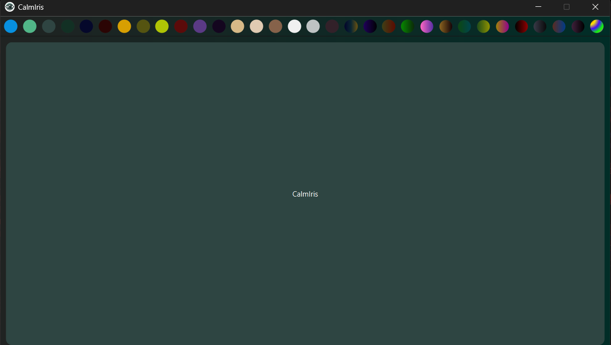
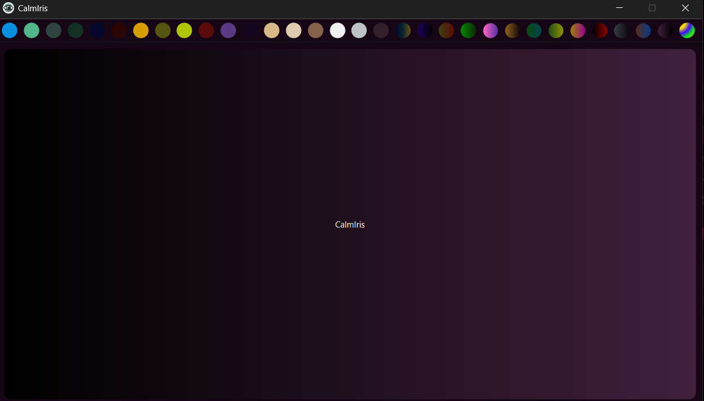
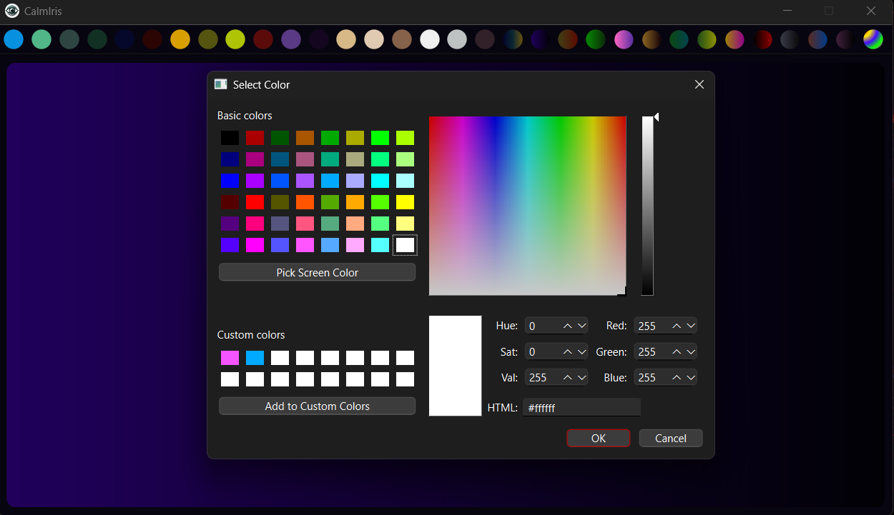

# CalmIris 👁️👁️

CalmIris is a basic theme-based app for windows which provides different eye catching or eye comforting colors on the app screen including normal colors to gradient colors as well, even you can also select color as per your choice :>

## Here is the some overview of the app

- *Basic view*
  

- *There are lot of built in colors available you can choose any of them as per your choice and give calm to your eye 👁️👁️*
  

- *Choose colors as your choice using built in colorpicker*

## If you want to install this app then you can install it by clicking given icon
  

## Contributing
Contributers are welcome! If you find an issue with the project, please feel free to raise it by navigating to the **Issues** tab on our GitHub page.

## License
This project is licensed under the [GNU License](https://github.com/CoderRony955/CalmIris/blob/master/LICENSE) - see the LICENSE file for details.

## Social

